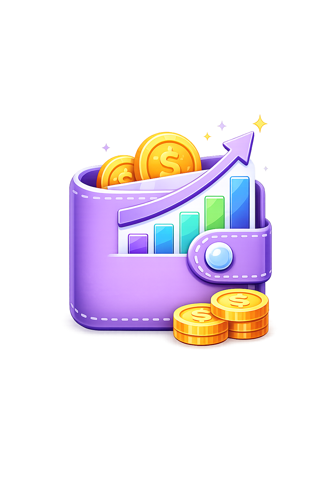

<div align="center">

<!-- ══════════════════════ 🎬 ANIMATED BANNER ══════════════════════ -->
<svg viewBox="0 0 1600 540" width="100%" xmlns="http://www.w3.org/2000/svg" role="img" aria-label="Budget Planner animated banner">
  <defs>
    <radialGradient id="bp-blob1" cx="30%" cy="20%" r="60%">
      <stop offset="0%" stop-color="#4f46e5" stop-opacity="0.55"/>
      <stop offset="100%" stop-color="#4f46e5" stop-opacity="0"/>
    </radialGradient>
    <radialGradient id="bp-blob2" cx="50%" cy="50%" r="50%">
      <stop offset="0%" stop-color="#0d9488" stop-opacity="0.45"/>
      <stop offset="100%" stop-color="#0d9488" stop-opacity="0"/>
    </radialGradient>
    <linearGradient id="bp-beam" x1="0" y1="0" x2="1" y2="0">
      <stop offset="0%" stop-color="#818cf8">
        <animate attributeName="stop-color" values="#818cf8;#34d399;#f472b6;#818cf8" dur="12s" repeatCount="indefinite"/>
      </stop>
      <stop offset="50%" stop-color="#c084fc">
        <animate attributeName="stop-color" values="#c084fc;#22d3ee;#fbbf24;#c084fc" dur="12s" repeatCount="indefinite"/>
      </stop>
      <stop offset="100%" stop-color="#22d3ee">
        <animate attributeName="stop-color" values="#22d3ee;#8b5cf6;#f472b6;#22d3ee" dur="12s" repeatCount="indefinite"/>
      </stop>
    </linearGradient>
    <linearGradient id="bp-title" x1="0" y1="0" x2="1" y2="0">
      <stop offset="0%" stop-color="#a5b4fc">
        <animate attributeName="stop-color" values="#a5b4fc;#6ee7b7;#f9a8d4;#a5b4fc" dur="10s" repeatCount="indefinite"/>
      </stop>
      <stop offset="55%" stop-color="#f0abfc">
        <animate attributeName="stop-color" values="#f0abfc;#67e8f9;#fcd34d;#f0abfc" dur="10s" repeatCount="indefinite"/>
      </stop>
      <stop offset="100%" stop-color="#67e8f9">
        <animate attributeName="stop-color" values="#67e8f9;#a78bfa;#f472b6;#67e8f9" dur="10s" repeatCount="indefinite"/>
      </stop>
    </linearGradient>
    <linearGradient id="bp-card" x1="0" y1="0" x2="1" y2="1">
      <stop offset="0%" stop-color="#818cf8"/>
      <stop offset="100%" stop-color="#22d3ee"/>
    </linearGradient>
  </defs>

  <!-- background -->
  <rect width="1600" height="540" fill="#0b1220"/>
  <rect x="10" y="10" width="1580" height="520" rx="26" fill="none" stroke="#334155" stroke-opacity="0.6"/>
  <rect x="10" y="10" width="1580" height="6" rx="3" fill="url(#bp-beam)"/>

  <!-- glow blobs -->
  <circle cx="240" cy="150" r="330" fill="url(#bp-blob1)">
    <animate attributeName="r" values="330;370;330" dur="9s" repeatCount="indefinite"/>
  </circle>
  <circle cx="1380" cy="430" r="340" fill="url(#bp-blob2)">
    <animate attributeName="r" values="340;300;340" dur="11s" repeatCount="indefinite"/>
  </circle>

  <!-- floating emojis -->
  <text x="150" y="125" font-size="42">💸
    <animateTransform attributeName="transform" type="translate" values="0 0;0 -14;0 0" dur="5s" repeatCount="indefinite"/>
  </text>
  <text x="365" y="95" font-size="34">✨
    <animate attributeName="opacity" values="0.15;1;0.15" dur="3.2s" repeatCount="indefinite"/>
  </text>
  <text x="1485" y="155" font-size="44">📈
    <animateTransform attributeName="transform" type="translate" values="0 0;0 -12;0 0" dur="6s" repeatCount="indefinite"/>
  </text>
  <text x="945" y="92" font-size="38">🪙
    <animateTransform attributeName="transform" type="translate" values="0 0;12 -10;0 0" dur="4.6s" repeatCount="indefinite"/>
  </text>

  <!-- logo badge -->
  <rect x="92" y="118" width="72" height="72" rx="24" fill="rgba(255,255,255,0.06)" stroke="url(#bp-card)" stroke-width="2.5"/>
  <text x="128" y="165" font-size="38" text-anchor="middle">💰</text>

  <!-- title -->
  <text x="120" y="252" font-family="'Segoe UI',system-ui,sans-serif" font-size="74" font-weight="800" fill="url(#bp-title)">Budget Planner</text>
  <text x="122" y="304" font-family="'Segoe UI',system-ui,sans-serif" font-size="26" fill="#94a3b8">Track expenses · Manage budgets · Grow your savings</text>

  <!-- tech chips -->
  <g font-family="'Segoe UI',system-ui,sans-serif" font-size="20" font-weight="600">
    <rect x="120" y="336" width="126" height="44" rx="22" fill="rgba(255,255,255,0.06)" stroke="rgba(255,255,255,0.16)"/>
    <text x="183" y="363" text-anchor="middle" fill="#e2e8f0">React</text>
    <rect x="260" y="336" width="152" height="44" rx="22" fill="rgba(255,255,255,0.06)" stroke="rgba(255,255,255,0.16)"/>
    <text x="336" y="363" text-anchor="middle" fill="#e2e8f0">TypeScript</text>
    <rect x="426" y="336" width="112" height="44" rx="22" fill="rgba(255,255,255,0.06)" stroke="rgba(255,255,255,0.16)"/>
    <text x="482" y="363" text-anchor="middle" fill="#e2e8f0">Vite</text>
    <rect x="552" y="336" width="168" height="44" rx="22" fill="rgba(255,255,255,0.06)" stroke="rgba(255,255,255,0.16)"/>
    <text x="636" y="363" text-anchor="middle" fill="#e2e8f0">Tailwind</text>
    <rect x="734" y="336" width="152" height="44" rx="22" fill="rgba(255,255,255,0.06)" stroke="rgba(255,255,255,0.16)"/>
    <text x="810" y="363" text-anchor="middle" fill="#e2e8f0">Firebase</text>
  </g>

  <!-- footer line -->
  <text x="120" y="500" font-family="'Segoe UI',system-ui,sans-serif" font-size="20" fill="#64748b">⭐ Your money, beautifully organized.</text>
  <text x="1480" y="500" font-family="'Segoe UI',system-ui,sans-serif" font-size="20" fill="#64748b" text-anchor="end">★★★★★</text>

  <!-- ═══ Mock dashboard card (right) ═══ -->
  <g>
    <animateTransform attributeName="transform" type="translate" values="0 0;0 -10;0 0" dur="6s" repeatCount="indefinite"/>
    <rect x="1050" y="66" width="380" height="410" rx="32" fill="rgba(255,255,255,0.05)" stroke="rgba(255,255,255,0.16)" stroke-width="2"/>

    <!-- header -->
    <circle cx="1086" cy="104" r="6" fill="#f87171"/>
    <circle cx="1108" cy="104" r="6" fill="#fbbf24"/>
    <circle cx="1130" cy="104" r="6" fill="#34d399"/>
    <circle cx="1338" cy="104" r="5" fill="#34d399">
      <animate attributeName="opacity" values="1;0.2;1" dur="1.6s" repeatCount="indefinite"/>
    </circle>
    <text x="1366" y="110" font-family="'Segoe UI',system-ui,sans-serif" font-size="19" fill="#e2e8f0" text-anchor="end">Monthly overview</text>

    <!-- stat pills -->
    <rect x="1080" y="134" width="150" height="56" rx="16" fill="rgba(255,255,255,0.05)"/>
    <text x="1096" y="156" font-family="'Segoe UI',system-ui,sans-serif" font-size="14" fill="#94a3b8">Income</text>
    <text x="1096" y="178" font-family="'Segoe UI',system-ui,sans-serif" font-size="19" font-weight="700" fill="#34d399">$12,400</text>
    <rect x="1250" y="134" width="150" height="56" rx="16" fill="rgba(255,255,255,0.05)"/>
    <text x="1266" y="156" font-family="'Segoe UI',system-ui,sans-serif" font-size="14" fill="#94a3b8">Expenses</text>
    <text x="1266" y="178" font-family="'Segoe UI',system-ui,sans-serif" font-size="19" font-weight="700" fill="#f87171">$8,150</text>

    <!-- donut chart -->
    <g transform="rotate(-90 1220 262)">
      <circle cx="1220" cy="262" r="50" fill="none" stroke="rgba(255,255,255,0.08)" stroke-width="16"/>
      <circle cx="1220" cy="262" r="50" fill="none" stroke="#818cf8" stroke-width="16" stroke-linecap="round" stroke-dasharray="228 86">
        <animate attributeName="stroke-dasharray" values="228 86;176 138;228 86" dur="5s" repeatCount="indefinite"/>
      </circle>
    </g>
    <text x="1220" y="268" font-family="'Segoe UI',system-ui,sans-serif" font-size="18" font-weight="700" fill="#e2e8f0" text-anchor="middle">68%</text>

    <!-- sparkline -->
    <path d="M1080 322 L1110 308 L1140 318 L1170 296 L1200 306 L1230 284 L1260 296 L1290 276 L1320 286 L1350 268 L1400 276"
          fill="none" stroke="#34d399" stroke-width="4" stroke-linecap="round" stroke-linejoin="round"
          stroke-dasharray="420" stroke-dashoffset="420">
      <animate attributeName="stroke-dashoffset" values="420;0;0;420" dur="7s" repeatCount="indefinite"/>
    </path>

    <!-- animated bars -->
    <g>
      <rect x="1082" y="392" width="30" height="50" rx="9" fill="#6366f1">
        <animate attributeName="y" values="392;368;392" dur="2.8s" repeatCount="indefinite"/>
        <animate attributeName="height" values="50;74;50" dur="2.8s" repeatCount="indefinite"/>
      </rect>
      <rect x="1124" y="392" width="30" height="50" rx="9" fill="#8b5cf6">
        <animate attributeName="y" values="392;372;392" dur="3.2s" repeatCount="indefinite"/>
        <animate attributeName="height" values="50;70;50" dur="3.2s" repeatCount="indefinite"/>
      </rect>
      <rect x="1166" y="392" width="30" height="50" rx="9" fill="#a855f7">
        <animate attributeName="y" values="392;360;392" dur="2.4s" repeatCount="indefinite"/>
        <animate attributeName="height" values="50;82;50" dur="2.4s" repeatCount="indefinite"/>
      </rect>
      <rect x="1208" y="392" width="30" height="50" rx="9" fill="#d946ef">
        <animate attributeName="y" values="392;378;392" dur="3.6s" repeatCount="indefinite"/>
        <animate attributeName="height" values="50;64;50" dur="3.6s" repeatCount="indefinite"/>
      </rect>
      <rect x="1250" y="392" width="30" height="50" rx="9" fill="#ec4899">
        <animate attributeName="y" values="392;364;392" dur="2.2s" repeatCount="indefinite"/>
        <animate attributeName="height" values="50;78;50" dur="2.2s" repeatCount="indefinite"/>
      </rect>
      <rect x="1292" y="392" width="30" height="50" rx="9" fill="#f43f5e">
        <animate attributeName="y" values="392;375;392" dur="3s" repeatCount="indefinite"/>
        <animate attributeName="height" values="50;67;50" dur="3s" repeatCount="indefinite"/>
      </rect>
      <rect x="1334" y="392" width="30" height="50" rx="9" fill="#fb923c">
        <animate attributeName="y" values="392;366;392" dur="2.6s" repeatCount="indefinite"/>
        <animate attributeName="height" values="50;76;50" dur="2.6s" repeatCount="indefinite"/>
      </rect>
      <rect x="1376" y="392" width="30" height="50" rx="9" fill="#fbbf24">
        <animate attributeName="y" values="392;380;392" dur="3.4s" repeatCount="indefinite"/>
        <animate attributeName="height" values="50;62;50" dur="3.4s" repeatCount="indefinite"/>
      </rect>
    </g>
  </g>
</svg>
</div>
<!-- ══════════════════════ 🛡️ BADGES ══════════════════════ -->
<p align="center">
  <a href="https://budget-planner-seven-cyan.vercel.app">
    
  </a>
  
  
  
  
  
  
</p>

<!-- ══════════════════════ 📌 TABLE OF CONTENTS ══════════════════════ -->
<div align="center">
  <a href="#about-the-project">✨ About</a> &nbsp;·&nbsp;
  <a href="#features">🚀 Features</a> &nbsp;·&nbsp;
  <a href="#preview">🖼️ Preview</a> &nbsp;·&nbsp;
  <a href="#tech-stack">⚡ Tech Stack</a> &nbsp;·&nbsp;
  <a href="#project-structure">🗂️ Structure</a> &nbsp;·&nbsp;
  <a href="#getting-started">🛠️ Getting Started</a> &nbsp;·&nbsp;
  <a href="#environment-variables">🔐 Environment</a> &nbsp;·&nbsp;
  <a href="#license">📜 License</a>
</div>

<br/>

<!-- ══════════════════════ 💜 ABOUT ══════════════════════ -->
<h2 align="center" id="about-the-project" style="font-family:'Segoe UI',system-ui,sans-serif;font-size:2rem;font-weight:800;background:linear-gradient(90deg,#818cf8,#c084fc,#22d3ee);-webkit-background-clip:text;-webkit-text-fill-color:transparent;">✨ About the Project</h2>

<p align="center" style="font-size:16px;color:#64748b;max-width:820px;margin:0 auto;line-height:1.7;">
  <b>Budget Planner</b> is a modern, beautiful personal-finance manager built with
  <b>React 19</b>, <b>TypeScript</b> and <b>Vite</b>. Track income &amp; expenses, plan budgets,
  set savings goals, manage debts and explore interactive analytics — all inside one stunning,
  fully customizable dashboard. Deployed on <b>Vercel</b>, installable as a <b>PWA</b>,
  and localized in <b>English</b> &amp; <b>Русский</b>. 🌍
</p>

<br/>
<!-- ══════════════════════ 🚀 FEATURES ══════════════════════ -->
<h2 align="center" id="features" style="font-family:'Segoe UI',system-ui,sans-serif;font-size:2rem;font-weight:800;background:linear-gradient(90deg,#f472b6,#c084fc,#60a5fa);-webkit-background-clip:text;-webkit-text-fill-color:transparent;">🚀 Features</h2>

<div align="center" style="display:flex;flex-wrap:wrap;justify-content:center;gap:16px;max-width:1080px;margin:0 auto;">

  <div style="background:linear-gradient(145deg,rgba(99,102,241,0.1),rgba(255,255,255,0.55));border:1px solid rgba(99,102,241,0.28);border-radius:20px;padding:20px 18px;width:300px;text-align:left;">
    <div style="width:46px;height:46px;border-radius:14px;background:linear-gradient(135deg,#6366f1,#a855f7);display:flex;align-items:center;justify-content:center;font-size:24px;margin-bottom:12px;">📊</div>
    <b style="font-size:16px;">Smart Dashboard</b>
    <div style="font-size:14px;color:#64748b;margin-top:6px;line-height:1.6;">Real-time overview of balance, income &amp; expenses with animated stat cards and live charts.</div>
  </div>

  <div style="background:linear-gradient(145deg,rgba(14,165,233,0.1),rgba(255,255,255,0.55));border:1px solid rgba(14,165,233,0.3);border-radius:20px;padding:20px 18px;width:300px;text-align:left;">
    <div style="width:46px;height:46px;border-radius:14px;background:linear-gradient(135deg,#0ea5e9,#22d3ee);display:flex;align-items:center;justify-content:center;font-size:24px;margin-bottom:12px;">📈</div>
    <b style="font-size:16px;">Analytics &amp; Reports</b>
    <div style="font-size:14px;color:#64748b;margin-top:6px;line-height:1.6;">Interactive Recharts visualizations — trends, category breakdowns and monthly comparisons.</div>
  </div>

  <div style="background:linear-gradient(145deg,rgba(16,185,129,0.1),rgba(255,255,255,0.55));border:1px solid rgba(16,185,129,0.3);border-radius:20px;padding:20px 18px;width:300px;text-align:left;">
    <div style="width:46px;height:46px;border-radius:14px;background:linear-gradient(135deg,#10b981,#34d399);display:flex;align-items:center;justify-content:center;font-size:24px;margin-bottom:12px;">💸</div>
    <b style="font-size:16px;">Transactions</b>
    <div style="font-size:14px;color:#64748b;margin-top:6px;line-height:1.6;">Log income and expenses with type-safe validation via React Hook Form + Zod.</div>
  </div>

  <div style="background:linear-gradient(145deg,rgba(245,158,11,0.1),rgba(255,255,255,0.55));border:1px solid rgba(245,158,11,0.32);border-radius:20px;padding:20px 18px;width:300px;text-align:left;">
    <div style="width:46px;height:46px;border-radius:14px;background:linear-gradient(135deg,#f59e0b,#fbbf24);display:flex;align-items:center;justify-content:center;font-size:24px;margin-bottom:12px;">🎯</div>
    <b style="font-size:16px;">Budgets</b>
    <div style="font-size:14px;color:#64748b;margin-top:6px;line-height:1.6;">Set monthly budget limits per category and watch your progress in real time.</div>
  </div>

  <div style="background:linear-gradient(145deg,rgba(244,63,94,0.1),rgba(255,255,255,0.55));border:1px solid rgba(244,63,94,0.28);border-radius:20px;padding:20px 18px;width:300px;text-align:left;">
    <div style="width:46px;height:46px;border-radius:14px;background:linear-gradient(135deg,#f43f5e,#fb7185);display:flex;align-items:center;justify-content:center;font-size:24px;margin-bottom:12px;">🪙</div>
    <b style="font-size:16px;">Savings Goals</b>
    <div style="font-size:14px;color:#64748b;margin-top:6px;line-height:1.6;">Define financial goals, deposit into them and track your journey visually.</div>
  </div>

  <div style="background:linear-gradient(145deg,rgba(139,92,246,0.1),rgba(255,255,255,0.55));border:1px solid rgba(139,92,246,0.28);border-radius:20px;padding:20px 18px;width:300px;text-align:left;">
    <div style="width:46px;height:46px;border-radius:14px;background:linear-gradient(135deg,#8b5cf6,#a78bfa);display:flex;align-items:center;justify-content:center;font-size:24px;margin-bottom:12px;">🔁</div>
    <b style="font-size:16px;">Recurring Transactions</b>
    <div style="font-size:14px;color:#64748b;margin-top:6px;line-height:1.6;">Automate recurring income and payments — rent, salary, subscriptions &amp; more.</div>
  </div>

  <div style="background:linear-gradient(145deg,rgba(239,68,68,0.1),rgba(255,255,255,0.55));border:1px solid rgba(239,68,68,0.3);border-radius:20px;padding:20px 18px;width:300px;text-align:left;">
    <div style="width:46px;height:46px;border-radius:14px;background:linear-gradient(135deg,#ef4444,#f87171);display:flex;align-items:center;justify-content:center;font-size:24px;margin-bottom:12px;">🏦</div>
    <b style="font-size:16px;">Debts</b>
    <div style="font-size:14px;color:#64748b;margin-top:6px;line-height:1.6;">Keep track of loans and debts with clear repayment amounts and deadlines.</div>
  </div>

  <div style="background:linear-gradient(145deg,rgba(20,184,166,0.1),rgba(255,255,255,0.55));border:1px solid rgba(20,184,166,0.3);border-radius:20px;padding:20px 18px;width:300px;text-align:left;">
    <div style="width:46px;height:46px;border-radius:14px;background:linear-gradient(135deg,#14b8a6,#2dd4bf);display:flex;align-items:center;justify-content:center;font-size:24px;margin-bottom:12px;">🏷️</div>
    <b style="font-size:16px;">Categories</b>
    <div style="font-size:14px;color:#64748b;margin-top:6px;line-height:1.6;">Fully customizable categories with your own colors, icons and spending limits.</div>
  </div>

  <div style="background:linear-gradient(145deg,rgba(132,204,22,0.1),rgba(255,255,255,0.55));border:1px solid rgba(132,204,22,0.3);border-radius:20px;padding:20px 18px;width:300px;text-align:left;">
    <div style="width:46px;height:46px;border-radius:14px;background:linear-gradient(135deg,#84cc16,#a3e635);display:flex;align-items:center;justify-content:center;font-size:24px;margin-bottom:12px;">📝</div>
    <b style="font-size:16px;">Notes</b>
    <div style="font-size:14px;color:#64748b;margin-top:6px;line-height:1.6;">Capture finance ideas and reminders right inside your workspace.</div>
  </div>

  <div style="background:linear-gradient(145deg,rgba(236,72,153,0.1),rgba(255,255,255,0.55));border:1px solid rgba(236,72,153,0.3);border-radius:20px;padding:20px 18px;width:300px;text-align:left;">
    <div style="width:46px;height:46px;border-radius:14px;background:linear-gradient(135deg,#ec4899,#f472b6);display:flex;align-items:center;justify-content:center;font-size:24px;margin-bottom:12px;">🔔</div>
    <b style="font-size:16px;">Notifications</b>
    <div style="font-size:14px;color:#64748b;margin-top:6px;line-height:1.6;">Smart alerts and reminders so you never miss a bill or a savings milestone.</div>
  </div>

  <div style="background:linear-gradient(145deg,rgba(99,102,241,0.1),rgba(255,255,255,0.55));border:1px solid rgba(99,102,241,0.28);border-radius:20px;padding:20px 18px;width:300px;text-align:left;">
    <div style="width:46px;height:46px;border-radius:14px;background:linear-gradient(135deg,#6366f1,#818cf8);display:flex;align-items:center;justify-content:center;font-size:24px;margin-bottom:12px;">🎨</div>
    <b style="font-size:16px;">Themes &amp; Dark Mode</b>
    <div style="font-size:14px;color:#64748b;margin-top:6px;line-height:1.6;">Light / dark mode plus accent colors — indigo, green, purple and blue.</div>
  </div>

  <div style="background:linear-gradient(145deg,rgba(6,182,212,0.1),rgba(255,255,255,0.55));border:1px solid rgba(6,182,212,0.3);border-radius:20px;padding:20px 18px;width:300px;text-align:left;">
    <div style="width:46px;height:46px;border-radius:14px;background:linear-gradient(135deg,#06b6d4,#22d3ee);display:flex;align-items:center;justify-content:center;font-size:24px;margin-bottom:12px;">🌍</div>
    <b style="font-size:16px;">i18n</b>
    <div style="font-size:14px;color:#64748b;margin-top:6px;line-height:1.6;">Full localization in English &amp; Русский with instant language switching.</div>
  </div>

  <div style="background:linear-gradient(145deg,rgba(245,158,11,0.1),rgba(255,255,255,0.55));border:1px solid rgba(245,158,11,0.32);border-radius:20px;padding:20px 18px;width:300px;text-align:left;">
    <div style="width:46px;height:46px;border-radius:14px;background:linear-gradient(135deg,#f59e0b,#f97316);display:flex;align-items:center;justify-content:center;font-size:24px;margin-bottom:12px;">💱</div>
    <b style="font-size:16px;">Multi-currency</b>
    <div style="font-size:14px;color:#64748b;margin-top:6px;line-height:1.6;">Work comfortably in UZS, USD, EUR or RUB with proper number formatting.</div>
  </div>

  <div style="background:linear-gradient(145deg,rgba(59,130,246,0.1),rgba(255,255,255,0.55));border:1px solid rgba(59,130,246,0.3);border-radius:20px;padding:20px 18px;width:300px;text-align:left;">
    <div style="width:46px;height:46px;border-radius:14px;background:linear-gradient(135deg,#3b82f6,#60a5fa);display:flex;align-items:center;justify-content:center;font-size:24px;margin-bottom:12px;">🔐</div>
    <b style="font-size:16px;">Secure Auth</b>
    <div style="font-size:14px;color:#64748b;margin-top:6px;line-height:1.6;">Firebase Authentication with email + one-click Google sign-in and protected routes.</div>
  </div>

  <div style="background:linear-gradient(145deg,rgba(100,116,139,0.12),rgba(255,255,255,0.55));border:1px solid rgba(100,116,139,0.3);border-radius:20px;padding:20px 18px;width:300px;text-align:left;">
    <div style="width:46px;height:46px;border-radius:14px;background:linear-gradient(135deg,#334155,#64748b);display:flex;align-items:center;justify-content:center;font-size:24px;margin-bottom:12px;">📱</div>
    <b style="font-size:16px;">PWA Ready</b>
    <div style="font-size:14px;color:#64748b;margin-top:6px;line-height:1.6;">Installable on any device, mobile-friendly and offline-capable.</div>
  </div>

  <div style="background:linear-gradient(145deg,rgba(16,185,129,0.1),rgba(255,255,255,0.55));border:1px solid rgba(16,185,129,0.3);border-radius:20px;padding:20px 18px;width:300px;text-align:left;">
    <div style="width:46px;height:46px;border-radius:14px;background:linear-gradient(135deg,#10b981,#14b8a6);display:flex;align-items:center;justify-content:center;font-size:24px;margin-bottom:12px;">⚡</div>
    <b style="font-size:16px;">Performance &amp; SEO</b>
    <div style="font-size:14px;color:#64748b;margin-top:6px;line-height:1.6;">Code-splitting, per-route meta tags, auto-generated sitemap and robots.txt.</div>
  </div>

</div>

<br/>
<!-- ══════════════════════ 🖼️ PREVIEW ══════════════════════ -->
<h2 align="center" id="preview" style="font-family:'Segoe UI',system-ui,sans-serif;font-size:2rem;font-weight:800;background:linear-gradient(90deg,#34d399,#22d3ee,#818cf8);-webkit-background-clip:text;-webkit-text-fill-color:transparent;">🖼️ Preview</h2>

<div align="center" style="margin-top:16px;">
  
  <p style="color:#94a3b8;font-size:14px;margin-top:8px;"><i>🏠 Landing page</i></p>
</div>

<div align="center" style="display:flex;flex-wrap:wrap;justify-content:center;gap:24px;margin-top:20px;">
  <figure style="margin:0;">
    
    <figcaption style="color:#94a3b8;font-size:14px;margin-top:8px;"><i>📱 Mobile dashboard</i></figcaption>
  </figure>
  <figure style="margin:0;">
    
    <figcaption style="color:#94a3b8;font-size:14px;margin-top:8px;"><i>📊 Analytics &amp; reports</i></figcaption>
  </figure>
</div>

<br/>
<!-- ══════════════════════ ⚡ TECH STACK ══════════════════════ -->
<h2 align="center" id="tech-stack" style="font-family:'Segoe UI',system-ui,sans-serif;font-size:2rem;font-weight:800;background:linear-gradient(90deg,#fbbf24,#f472b6,#8b5cf6);-webkit-background-clip:text;-webkit-text-fill-color:transparent;">⚡ Tech Stack</h2>

<p align="center" style="font-weight:700;color:#334155;margin-bottom:6px;">🎯 Core</p>
<p align="center">
  
  
  
  
  
  
</p>

<p align="center" style="font-weight:700;color:#334155;margin-bottom:6px;">🧠 Data &amp; State</p>
<p align="center">
  
  
  
  
  
  
</p>

<p align="center" style="font-weight:700;color:#334155;margin-bottom:6px;">✨ UX &amp; Quality</p>
<p align="center">
  
  
  
  
</p>

<br/>

<!-- ══════════════════════ 🗂️ PROJECT STRUCTURE ══════════════════════ -->
<h2 align="center" id="project-structure" style="font-family:'Segoe UI',system-ui,sans-serif;font-size:2rem;font-weight:800;background:linear-gradient(90deg,#22d3ee,#34d399,#a3e635);-webkit-background-clip:text;-webkit-text-fill-color:transparent;">🗂️ Project Structure</h2>

```
budget-planner/
├── public/                 # Static assets, PWA icons & screenshots
├── src/
│   ├── apiClient/          # HTTP / API layer
│   ├── assets/             # Images & icons
│   ├── components/         # Reusable UI components
│   ├── context/            # Auth & preferences context
│   ├── hooks/              # Data-fetching hooks (TanStack Query)
│   ├── layout/             # Auth / main layout shells
│   ├── locales/            # i18n translations (en, ru)
│   ├── pages/              # Pages — auth & dashboard
│   ├── seo/                # Per-route SEO (react-helmet-async)
│   ├── types/              # TypeScript domain types
│   ├── utils/              # Formatters, filters, i18n setup
│   ├── App.tsx             # App routes (React Router)
│   ├── firebase.tsx        # Firebase init & auth providers
│   └── main.tsx            # Entry point
├── index.html
├── package.json
├── tsconfig*.json
└── vite.config.ts          # Vite + PWA + sitemap plugins
```

<br/>
<!-- ══════════════════════ 🛠️ GETTING STARTED ══════════════════════ -->
<h2 align="center" id="getting-started" style="font-family:'Segoe UI',system-ui,sans-serif;font-size:2rem;font-weight:800;background:linear-gradient(90deg,#60a5fa,#818cf8,#c084fc);-webkit-background-clip:text;-webkit-text-fill-color:transparent;">🛠️ Getting Started</h2>

### ✅ Prerequisites

- **Node.js 20+** & **npm** installed

### 📦 Install & run

```bash
# 1. Clone the repository
git clone https://github.com/m-radjabova/budget_planner.git
cd budget-planner

# 2. Install dependencies
npm install

# 3. Create a .env file with your Firebase keys (see below)

# 4. Start the development server
npm run dev
```

Open [http://localhost:5173](http://localhost:5173) — the dev server will hot-reload on every change. 🎉

### 🧪 Available scripts

| Script              | Description                                    |
| ------------------- | ---------------------------------------------- |
| `npm run dev`       | Start the Vite dev server                      |
| `npm run build`     | Type-check (`tsc -b`) + production build       |
| `npm run preview`   | Preview the production build locally           |
| `npm run lint`      | Run ESLint across the codebase                 |

### 🚀 Deploy to Vercel

Push the repo to GitHub, import it in **Vercel** and you're done — the SPA rewrite, sitemap and `robots.txt` generation are already wired up in `vercel.json` and `vite.config.ts`.

<br/>

<!-- ══════════════════════ 🔐 ENVIRONMENT ══════════════════════ -->
<h2 align="center" id="environment-variables" style="font-family:'Segoe UI',system-ui,sans-serif;font-size:2rem;font-weight:800;background:linear-gradient(90deg,#34d399,#fbbf24,#f472b6);-webkit-background-clip:text;-webkit-text-fill-color:transparent;">🔐 Environment Variables</h2>

Create a `.env` file in the project root and fill it with your [Firebase](https://console.firebase.google.com) project keys:

| Variable                             | Description                          |
| ------------------------------------ | ------------------------------------ |
| `VITE_FIREBASE_API_KEY`              | Firebase API key                     |
| `VITE_FIREBASE_AUTH_DOMAIN`          | Firebase auth domain                 |
| `VITE_FIREBASE_PROJECT_ID`           | Firebase project ID                  |
| `VITE_FIREBASE_STORAGE_BUCKET`       | Firebase storage bucket              |
| `VITE_FIREBASE_MESSAGING_SENDER_ID`  | Firebase messaging sender ID         |
| `VITE_FIREBASE_APP_ID`               | Firebase app ID                      |
| `VITE_FIREBASE_MEASUREMENT_ID`       | Firebase analytics measurement ID    |

> ⚠️ **Never commit your `.env` file** — it's already covered by `.gitignore`.

<br/>
<!-- ══════════════════════ 🤝 CONTRIBUTING ══════════════════════ -->
<h2 align="center" id="contributing" style="font-family:'Segoe UI',system-ui,sans-serif;font-size:2rem;font-weight:800;background:linear-gradient(90deg,#a3e635,#34d399,#22d3ee);-webkit-background-clip:text;-webkit-text-fill-color:transparent;">🤝 Contributing</h2>

Contributions, issues and feature requests are always welcome! ✨

1. **Fork** the repository
2. Create your branch: `git checkout -b feature/amazing-idea`
3. Commit your changes: `git commit -m "✨ add amazing feature"`
4. Push: `git push origin feature/amazing-idea`
5. Open a **Pull Request** 🚀

> 💡 Great starting points: polish the UI, add new Recharts visualizations, write more tests, or add another language to `src/locales/`.

<br/>

<!-- ══════════════════════ 📜 LICENSE ══════════════════════ -->
<h2 align="center" id="license" style="font-family:'Segoe UI',system-ui,sans-serif;font-size:2rem;font-weight:800;background:linear-gradient(90deg,#fbbf24,#fb923c,#ef4444);-webkit-background-clip:text;-webkit-text-fill-color:transparent;">📜 License</h2>

<p align="center" style="font-size:15px;color:#64748b;">This project is open source and available for personal &amp; educational use. 💜</p>

<br/>

<hr style="border:none;height:3px;border-radius:2px;background:linear-gradient(90deg,#818cf8,#c084fc,#22d3ee,#34d399);"/>

<br/>

<!-- ══════════════════════ 💫 FOOTER ══════════════════════ -->
<div align="center">
  <p style="font-size:16px;">⭐ If you like this project, don't forget to <b>star</b> the repository — it really helps!</p>
  <p style="font-size:19px;font-weight:800;background:linear-gradient(90deg,#f472b6,#c084fc,#22d3ee);-webkit-background-clip:text;-webkit-text-fill-color:transparent;margin:14px 0;">Made with 💜 using React, TypeScript &amp; Vite</p>
  <p style="font-size:14px;">
    
    &nbsp;<a href="https://github.com/m-radjabova">@m-radjabova</a>
  </p>
  <p style="font-size:13px;color:#94a3b8;"><i>© 2026 Budget Planner — take control of your money 🚀</i></p>
</div>


